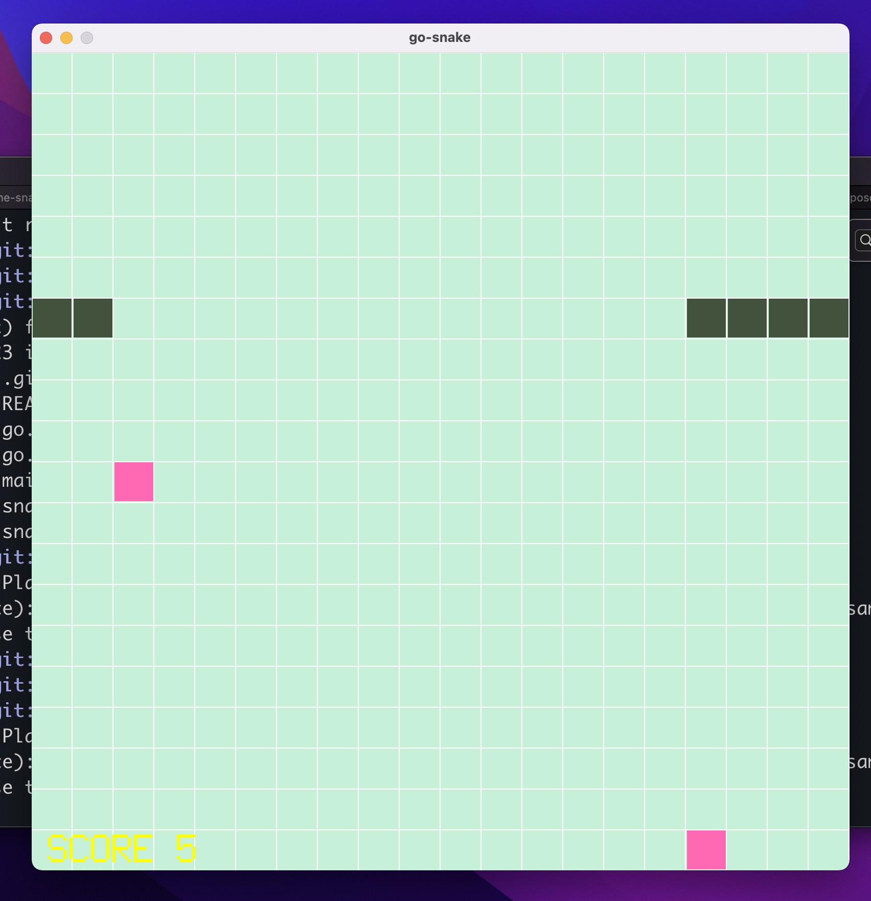

# go-snake

A quick and dirty snake game written in Golang with the Pixel framework. It could use better seperating between the game state and Pixel and more unit tests.
I may redo this, now that I know what I'm doing with Pixel and Golang.

